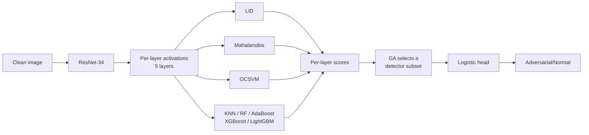

# Detecting Adversarial Examples with Layer-wise Detector Ensembles

This repository contains code for adversarial example detection on image classification systems. The pipeline combines a hybrid stacking ensemble — unsupervised detectors (LID, Mahalanobis, OCSVM) and supervised classifiers, read from a network's per-layer activations and stacked with a logistic head — with a genetic algorithm (GA) that selects the optimized detector subset for each attack scenario. It extends the ENAD approach by adding five supervised layer detectors and the GA selection step. Evaluated on CIFAR-10 and SVHN against four attacks (FGSM, BIM, DeepFool, CW-L2), plus a transfer setting where the detector is trained on one attack and tested on another. A small Gradio app scores an uploaded image end-to-end.

---

## Key features

- **8 detectors** over 5 ResNet layers: LID, Mahalanobis, OCSVM (the ENAD baseline) + KNN,
  Random Forest, AdaBoost, XGBoost, LightGBM (this project's additions).
- **Stacking head** (logistic regression) over the selected detectors' per-layer scores.
- **GA subset selection** — frames "which detectors to keep" as a search, optimising
  AUROC×AUPR with an optional parsimony penalty that favours smaller subsets.
- **Transfer evaluation** — train on FGSM, detect an unseen attack.
- **Gradio demo** — upload an image, get *adversarial* / *normal*, for ENAD, ENAD-full, or ENAD-GA.

---

## Method

Each detector reads the mean activation of each of the ResNet's five residual stages and produces
one score per layer. Those scores are concatenated and a logistic head makes the final call.
LID and Mahalanobis are unsupervised distance/geometry detectors; OCSVM is a one-class SVM; the
five supervised detectors are trained to separate adversarial from clean/noisy activations.

**Genetic algorithm.** With eight detectors there are 255 possible subsets per attack. The GA
searches this space, scoring each candidate subset by its `AUROC x AUPR` on a held-out
GA-validation split, and keeps the best. An optional parsimony term (see below) nudges it toward
smaller subsets when several perform similarly.

**Data splits (no leakage).** Each attack's data is split once into
train (5%) / detector-val (5%) / GA-val (10%) / **test (80%)**. Detectors and the logistic head
are fit on train; the GA selects its subset on GA-val; **every reported number is on the test
split, which selection never touches.** In the transfer setting the separation is stricter: the
head is trained on the *source* attack (FGSM) train+val, the GA selects on the *source* GA-val,
and the final number is measured on the *target* attack's test split with the target detectors,
so the selector never sees the target attack.

---

## Results

Metrics are **AUROC / AUPR / F1** (%), all on the held-out test split. **ENAD** is the baseline of
LID + Mahalanobis + OCSVM; **ENAD-full** adds all five supervised detectors. Full stacking is the
main configuration; the GA subset is reported separately as an exploratory result.

On the **standard** setting (train and test on the same attack), adding the supervised detectors
lifts detection across every attack, and the GA matches full stacking while using fewer
detectors — on several attacks a 1-3 detector subset equals or beats all eight.

<h3>Standard setting (train and test on the same attack)</h3>

<table>
<thead>
<tr>
<th rowspan="2"></th><th rowspan="2"></th>
<th colspan="3">FGSM</th><th colspan="3">BIM</th><th colspan="3">DeepFool</th><th colspan="3">CW-L2</th>
</tr>
<tr>
<th>AUROC</th><th>AUPR</th><th>F1</th>
<th>AUROC</th><th>AUPR</th><th>F1</th>
<th>AUROC</th><th>AUPR</th><th>F1</th>
<th>AUROC</th><th>AUPR</th><th>F1</th>
</tr>
</thead>
<tbody>
<tr>
<td rowspan="4"><b>CIFAR-10</b></td>
<td>ENAD</td>
<td>99.96</td><td>99.92</td><td>99.65</td>
<td>99.76</td><td>99.52</td><td>97.15</td>
<td>92.79</td><td>88.54</td><td>79.81</td>
<td>90.77</td><td>81.48</td><td>76.92</td>
</tr>
<tr>
<td><b>ENAD-full</b></td>
<td><b>99.99</b></td><td><b>99.99</b></td><td><b>99.91</b></td>
<td><b>99.94</b></td><td><b>99.92</b></td><td><b>98.98</b></td>
<td><b>94.21</b></td><td><b>91.26</b></td><td><b>82.19</b></td>
<td><b>93.96</b></td><td><b>88.53</b></td><td><b>80.90</b></td>
</tr>
<tr>
<td>ENAD-GA</td>
<td>99.99</td><td>99.99</td><td>99.99</td>
<td>99.92</td><td>99.80</td><td>99.21</td>
<td>94.18</td><td>91.34</td><td>82.13</td>
<td>93.66</td><td>88.01</td><td>80.47</td>
</tr>
<tr>
<td><i>GA subset</i></td>
<td colspan="3"><code>AdaBoost</code></td>
<td colspan="3"><code>Maha+AB+XGB</code></td>
<td colspan="3"><code>Maha+OCSVM+KNN+RF+AB+XGB</code></td>
<td colspan="3"><code>Maha+OCSVM+KNN+AB+XGB+LGBM</code></td>
</tr>
<tr>
<td rowspan="4"><b>SVHN</b></td>
<td>ENAD</td>
<td>99.51</td><td>97.25</td><td>97.75</td>
<td>98.30</td><td>96.13</td><td>90.68</td>
<td>96.43</td><td>94.31</td><td>86.92</td>
<td>94.53</td><td>89.16</td><td>84.55</td>
</tr>
<tr>
<td><b>ENAD-full</b></td>
<td><b>99.90</b></td><td><b>99.37</b></td><td><b>99.19</b></td>
<td><b>99.87</b></td><td><b>99.77</b></td><td><b>98.44</b></td>
<td><b>97.41</b></td><td><b>96.02</b></td><td><b>89.12</b></td>
<td><b>95.43</b></td><td><b>92.16</b></td><td><b>85.62</b></td>
</tr>
<tr>
<td>ENAD-GA</td>
<td>99.98</td><td>99.97</td><td>99.41</td>
<td>99.91</td><td>99.83</td><td>98.28</td>
<td>97.38</td><td>95.97</td><td>89.06</td>
<td>95.42</td><td>92.24</td><td>85.42</td>
</tr>
<tr>
<td><i>GA subset</i></td>
<td colspan="3"><code>LID+RF</code></td>
<td colspan="3"><code>AdaBoost</code></td>
<td colspan="3"><code>LID+Maha+OCSVM+KNN+AB+XGB</code></td>
<td colspan="3"><code>LID+Maha+KNN+RF+AB+XGB+LGBM</code></td>
</tr>
</tbody>
</table>

Adding the supervised detectors helps everywhere, most on the harder DeepFool / CW-L2 attacks. The GA row matches full stacking while using far fewer detectors: on several attacks a 1-3 detector subset equals or beats all eight (e.g. SVHN/BIM, where a single AdaBoost detector at 99.91 AUROC edges out all eight at 99.87).

<h3>Transfer setting (train on FGSM, detect a different attack)</h3>

<table>
<thead>
<tr>
<th rowspan="2"></th><th rowspan="2"></th>
<th colspan="3">BIM</th><th colspan="3">DeepFool</th><th colspan="3">CW-L2</th>
</tr>
<tr>
<th>AUROC</th><th>AUPR</th><th>F1</th>
<th>AUROC</th><th>AUPR</th><th>F1</th>
<th>AUROC</th><th>AUPR</th><th>F1</th>
</tr>
</thead>
<tbody>
<tr>
<td rowspan="4"><b>CIFAR-10</b></td>
<td>ENAD</td>
<td>98.78</td><td>97.58</td><td>92.43</td>
<td>85.72</td><td>80.45</td><td>72.76</td>
<td>63.47</td><td>49.37</td><td>50.00</td>
</tr>
<tr>
<td><b>ENAD-full</b></td>
<td><b>99.34</b></td><td><b>98.70</b></td><td><b>95.12</b></td>
<td><b>88.96</b></td><td><b>82.70</b></td><td><b>74.46</b></td>
<td><b>77.15</b></td><td><b>58.50</b></td><td><b>61.99</b></td>
</tr>
<tr>
<td>ENAD-GA</td>
<td>99.57</td><td>99.36</td><td>96.47</td>
<td>71.67</td><td>65.20</td><td>55.94</td>
<td>58.23</td><td>41.10</td><td>50.11</td>
</tr>
<tr>
<td><i>GA subset</i></td>
<td colspan="9"><code>LID+RF</code> &nbsp;(same subset for all three targets — selected on the fixed FGSM source)</td>
</tr>
<tr>
<td rowspan="4"><b>SVHN</b></td>
<td>ENAD</td>
<td>35.13</td><td>24.81</td><td>50.00</td>
<td>81.69</td><td>76.06</td><td>67.76</td>
<td>48.94</td><td>55.25</td><td>50.00</td>
</tr>
<tr>
<td><b>ENAD-full</b></td>
<td><b>74.30</b></td><td><b>56.39</b></td><td><b>60.33</b></td>
<td><b>91.26</b></td><td><b>87.21</b></td><td><b>78.66</b></td>
<td>45.02</td><td>48.59</td><td>50.00</td>
</tr>
<tr>
<td>ENAD-GA</td>
<td>99.80</td><td>99.68</td><td>97.62</td>
<td>88.86</td><td>83.26</td><td>74.99</td>
<td>89.04</td><td>83.30</td><td>77.85</td>
</tr>
<tr>
<td><i>GA subset</i></td>
<td colspan="9"><code>RF+XGB</code> &nbsp;(same subset for all three targets — selected on the fixed FGSM source)</td>
</tr>
</tbody>
</table>

Transfer is genuinely hard: the baseline collapses in several cells (an AUROC near or below 50 means the FGSM-tuned detector does not carry over to the target attack). Full stacking is markedly more robust. The **GA** here tells a mixed story — because FGSM is nearly saturated on the GA-validation split, the selector commits to the *same* small subset for all three targets, which transfers well to same-family attacks (SVHN BIM 74->99.8, CW-L2 45->89) but **loses** on CIFAR-10 DeepFool / CW-L2, where that subset does not match the target geometry. **For transfer, full stacking is the more reliable choice; GA-transfer is a finding, not a recommendation.**

## Parsimony penalty

The GA maximises `AUROC x AUPR - lambda * (#detectors / 8)`. The default `lambda = 0.002` was
chosen empirically — it tends to select fewer detectors at comparable accuracy across the attacks
tested, which is where the "1-3 detectors ~ all 8" results above come from. It has not been swept
exhaustively; set `lambda = 0` to disable the penalty and select purely on `AUROC x AUPR`.

---

## Repository layout & pipeline

The pipeline is a sequence of Kaggle notebooks. Each notebook's outputs are published as a Kaggle
dataset that the next notebook reads, so stages can be run and re-run independently.

| Notebook | Role | Produces |
|---|---|---|
| `attack generation` | Generate FGSM / BIM / DeepFool / CW-L2 adversarial + noisy tensors | `attacked-pth-files` |
| `lid mahalanobis feature extraction` | Extract LID & Mahalanobis scores across magnitudes/neighbourhoods | `mahalanobis-and-lid-numpy` |
| `ocsvm lid maha detector` | Fit OCSVM per layer; select best LID/Maha settings | `enad-ocsvm-pkl`, `best-numpy` |
| `supervised detector` | Template: fit one supervised detector x one attack (KNN/RF/AdaBoost/XGBoost/LightGBM) | `enad-pkl` |
| `ensemble` | Stacking, GA subset search, standard **and** transfer evaluation | the tables above |
| `demo assets` | Build seeded assets for the app (Maha stats, LID reference, best m/k, logistic heads) | `enad-demo-assets` |
| `gradio demo` | Upload an image -> adversarial / normal (ENAD / ENAD-full / ENAD-GA) | live app |
| `export test images` | Utility: dump clean/adv/noisy PNGs from the attacked tensors to test the demo | test images |

Shared logic lives in three modules that the notebooks include: `enad_common` (model, data splits,
loaders, detector registry), `enad_ensemble` (stacking, GA, standard & transfer runners), and
`enad_demo` (single-image scoring and the demo).

---

## How to run

Everything runs on **Kaggle with a T4 GPU and Internet ON** (the notebooks `git clone` the
upstream Mahalanobis repo for the ResNet definition and data loaders).

1. **`attack generation`** -> publish `attacked-pth-files`.
2. **`lid mahalanobis feature extraction`** -> publish `mahalanobis-and-lid-numpy`.
3. **`ocsvm lid maha detector`** -> publish `enad-ocsvm-pkl` and `best-numpy`.
4. **`supervised detector`** — Copy & Edit, set `DETECTOR` / `ADV_TYPE` / `DS_NAME`, run each
   (detector x attack x dataset) shard; collect all outputs into one dataset **`enad-pkl`**
   (keep the `.npy` files next to the `.pkl` — the ensemble reads test scores from them).
5. **`ensemble`** — set the dataset roots, choose `MODE` (`full` / `ga` / `custom`) for the
   standard and transfer runs.
6. **`demo assets`** -> publish `enad-demo-assets`.
7. **`gradio demo`** — attach `enad-demo-assets`, `enad-ocsvm-pkl`, `enad-pkl`, and the weights
   dataset; run to launch the app.

Point each notebook's `WEIGHTS_DIR` / dataset roots at your own Kaggle dataset paths.

---

## Attribution

This project builds directly on two prior works and adds its own contributions on top.

**ENAD — "Unity is strength: Improving the Detection of Adversarial Examples with Ensemble
Approaches"** (BIMIB-DISCo, [ENAD-experiments](https://github.com/BIMIB-DISCo/ENAD-experiments)).
The LID + Mahalanobis + OCSVM detectors, the idea of stacking per-layer detectors with a logistic
head, and the transfer-attack evaluation idea come from ENAD.

**Deep Mahalanobis detector** (Lee et al., NeurIPS 2018,
[pokaxpoka/deep_Mahalanobis_detector](https://github.com/pokaxpoka/deep_Mahalanobis_detector)).
The ResNet-34 architecture, the pretrained weights, and the CIFAR-10 / SVHN loaders come from
this repository (cloned at runtime). The Mahalanobis and LID scoring routines follow this lineage
(Lee et al., 2018; Ma et al., 2018).

**This project's own contributions.**
- The five **supervised layer detectors** (KNN, Random Forest, AdaBoost, XGBoost, LightGBM) —
  design and implementation.
- The **genetic-algorithm subset selection** — both the idea of framing detector selection as a
  GA search and its implementation.
- The **transfer-attack evaluation** follows the protocol described in the ENAD paper; since the
  authors did not release code for it, this implementation was reconstructed from the paper's
  description and may differ in details.

---

## Notes and limitations

- **Reproducibility over matching prior runs.** All results come from a fully seeded pipeline. They
  are not expected to match numbers from earlier unseeded runs to the decimal; a reproducible,
  self-consistent set of numbers was preferred.
- **Single-image demo — LID is approximate.** LID needs a reference set of neighbours. During
  training that reference is the in-batch clean data; a single uploaded image has no batch, so the
  demo uses a fixed sample of the training set instead. Mahalanobis, OCSVM, and the supervised
  detectors are scored exactly as in training.
- **PNG round-trip.** Test images exported to PNG are 8-bit; the tiny perturbations of CW-L2 /
  DeepFool can be lost in that quantisation, so those may read as *normal* in the demo. FGSM / BIM
  survive the round-trip and are the reliable ones to demo with.
- **Scope.** ResNet-34 on CIFAR-10 and SVHN, four attacks. Other architectures, datasets, and
  adaptive (detector-aware) attacks are out of scope here.
